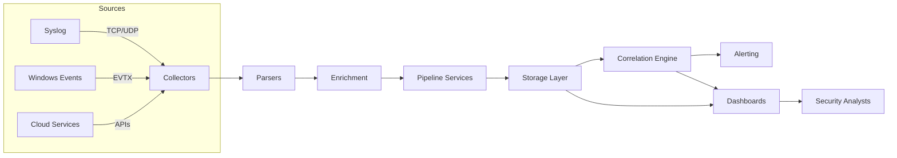

<div align="center">

# SentriAI – SIEM Platform

_Cloud-ready security telemetry pipeline for real-time detection, enrichment, and response._

[Quick Start](#quick-start) · [Architecture](#architecture-overview) · [Deployment](#deployment-options) · [Docs](docs/)

</div>

<p align="center">
  <a href="https://github.com/eminemahjoub/SentriAI/actions/workflows/ci.yml">
    
  </a>
  <a href="https://img.shields.io/badge/python-3.8%2B-blue.svg">
    
  </a>
  <a href="LICENSE">
    
  </a>
  <a href="docs/ARCHITECTURE.md">
    
  </a>
</p>

---

SentriAI is a modular Security Information and Event Management (SIEM) platform focused on rapid ingestion, enrichment, correlation, and visualization of security telemetry. It enables security teams to detect threats earlier, surface enriched alerts, and automate response workflows.

## Table of Contents

1. Features
2. Architecture Overview
3. Prerequisites
4. Quick Start
5. Configuration
6. Deployment Options
7. Project Structure
8. Testing
9. Observability
10. Contributing
11. License

## Features

- Flexible collectors for Syslog, Windows Event Logs, and cloud-native sources.
- Unified parsing pipeline that normalizes events into a common JSON schema.
- Contextual enrichment with GeoIP and threat intelligence providers.
- Rule-based correlation alongside anomaly detection models.
- Multi-channel alerting (email, Slack, Telegram, Discord).
- REST & GraphQL APIs for integrations and automation.
- Dashboards for security analysts (Grafana, Kibana, web UI stub).
- Infrastructure-as-code (Docker, Helm, Terraform) for repeatable deployments.

## Architecture Overview



The platform follows a pipeline architecture:

1. Collectors (`src/collectors/`) pull telemetry from various sources.
2. Parsers (`src/parsers/`) normalize events into structured JSON.
3. Enrichers (`src/enrichment/`) add GeoIP and threat-intel context.
4. Pipeline services (`src/pipeline/`) orchestrate ingestion, parsing, and indexing.
5. Storage via Elasticsearch and optional cold storage adapters.
6. Correlation engine (`src/correlation/`) applies detection rules and ML models.
7. Alerting (`src/alerting/`) dispatches notifications to configured channels.
8. APIs & UI expose insights through REST, GraphQL, and dashboards.

See `docs/ARCHITECTURE.md` for a detailed component breakdown.

## Prerequisites

- Python 3.8+
- Git
- Docker Desktop (with Docker Compose) for local stacks
- Optional: Kubernetes CLI + Helm, Terraform for advanced deployments

Recommended host resources for local testing: 4 CPUs, 8 GB RAM, and 20 GB free disk space.

## Quick Start

```
git clone https://github.com/your-org/SentriAI.git
cd SentriAI
python -m venv .venv        # or: py -m virtualenv .venv on Windows
source .venv/bin/activate   # Windows: .venv\Scripts\activate
pip install -r requirements.txt
```

Bring up the reference stack:

```
cd infra/docker
docker-compose up -d
docker-compose logs -f      # optional: monitor startup
```

Seed sample events (optional):

```
cd ../../scripts/python
python run_e2e_local.py --events ../examples/sample_events/linux_syslog.log
```

Launch APIs and the demo dashboard:

```
uvicorn src.api.rest_api:app --reload --port 8000
uvicorn src.api.graphql_api:app --reload --port 8001
python src/ui/web_dashboard/frontend_stub.py
```

Open `http://localhost:8000/docs` for REST docs and `http://localhost:3000` for the dashboard stub.

## Configuration

All runtime settings live in `configs/`:

- `collectors.yml` – source endpoints, credentials, scheduling.
- `ingestion.yml` – parser/enricher toggles, batching, retry policies.
- `logging.yml` – log levels, destinations.
- `alerting.yml` – channels, templates, routing rules.

Customize these files before deploying. Avoid committing secrets; use environment variables or secret managers in production.

## Deployment Options

Choose the path that matches your environment:

### Local (Docker Compose)

```
cd infra/docker
docker-compose up -d
```

This starts Elasticsearch, supporting services, and sample dashboards.

### Kubernetes (Helm)

```
kubectl config use-context <cluster>
cd infra/helm/siem-chart
helm install sentriai .
```

Update `values.yml` to point to your own storage, secrets, and ingress.

### Cloud (Terraform)

```
cd infra/terraform/cloud
terraform init
terraform apply
```

Provide cloud credentials and desired resources in the Terraform variables before applying.

Refer to `docs/DEPLOYMENT_RUNBOOK.md` for detailed instructions and troubleshooting tips.

## Project Structure

```
SentriAI/
├── configs/            # YAML configuration templates
├── docs/               # Architecture, runbooks, playbooks
├── infra/              # Docker, Helm, Kubernetes, Terraform manifests
├── scripts/            # Operational and data scripts
├── src/                # Application source code (collectors, pipeline, APIs, ML)
├── dashboards/         # Grafana/Kibana dashboard exports
├── models/             # Trained models and training data
├── tests/              # Unit, integration, and e2e tests
└── examples/           # Sample events and alerts for testing
```

## Testing

Activate your virtual environment, then run:

```
pytest
```

Use markers (`-m`) to scope to `unit`, `integration`, or `e2e` suites as needed.

## Observability

- Prometheus & Grafana: metrics collection and visualization (`observability/prometheus`, `dashboards/grafana`).
- Loki: centralized log aggregation (`observability/loki`).
- Kibana: search across ingested events (`dashboards/kibana`).

These components are opinionated defaults—adapt them to your tooling stack.

## Contributing

We welcome contributions! Start with `docs/CONTRIBUTING.md` for coding standards, branching strategy, and the review process. Please open an issue before introducing large features and ensure new code includes tests.

## License

SentriAI is released under the MIT License. See `LICENSE` for the full text.
