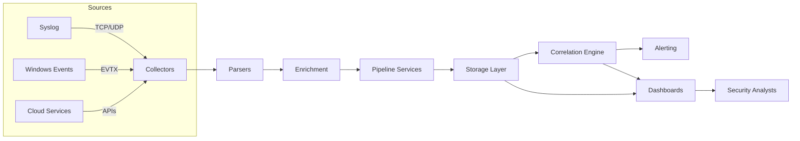
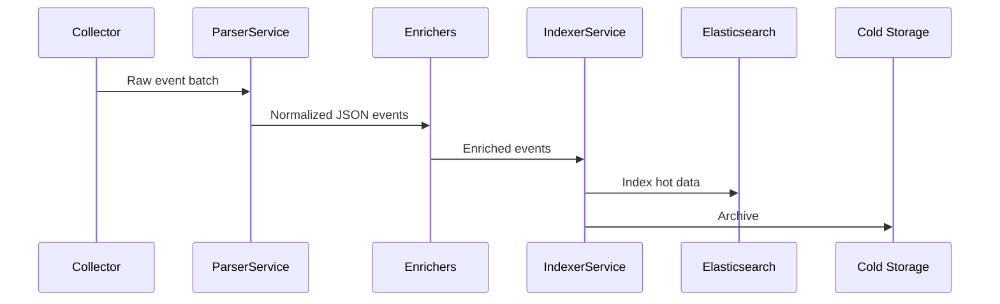

# SentriAI Architecture

SentriAI follows a layered SIEM architecture that collects telemetry from disparate sources, normalizes and enriches it, and surfaces actionable insights through correlation, alerting, and visual analytics.

## At a Glance



## Architectural Components

### Collectors
- `SyslogCollector` ingests syslog streams over TCP/UDP.
- `WindowsEventCollector` pulls EVTX events via WinRM or local agents.
- `CloudEventsCollector` integrates with cloud-native APIs (e.g., AWS CloudTrail, Azure Sentinel exports).
- Collectors normalize transport-level metadata and hand off batches to the parsing tier.

### Parsers
- `SyslogParser`, `EvtxParser`, and `JsonLogParser` convert source formats into a canonical JSON event shape.
- Each parser validates required fields and tags events with the originating source, tenant, and parser version.

### Enrichment
- `GeoIPEnricher` appends geolocation attributes using MaxMind or similar databases.
- `ThreatIntelEnricher` correlates hashes, IPs, and domains against threat feeds or the internal knowledge base.
- Enrichers are composable; they can be toggled per source through `configs/ingestion.yml`.

### Pipeline Services
- `IngestService` orchestrates collectors, batching, and back-pressure.
- `ParserService` routes events to the correct parser based on source metadata.
- `IndexerService` writes to Elasticsearch for hot search and to optional PostgreSQL/cold-storage for retention.



### Storage
- **Elasticsearch** powers real-time search, dashboards, and correlation queries.
- **Cold storage** (object store, glacier tiers, or S3-compatible) ensures cost-efficient long-term retention.
- Optional **PostgreSQL** tables provide structured analytics or compliance exports.

### Correlation & Analytics
- `CorrelationEngine` evaluates rule packs from `rules/detections/` and returns deterministic alerts.
- Anomaly detection models in `src/ml/anomaly_detection.py` score behavioral deviations.
- Composite alerts merge rule hits and anomaly scores with context from enrichment.

### Alerting & Response
- `AlertRules` map detections to routing policies.
- `AlertDispatcher` delivers notifications over Email, Slack, Telegram, Discord, or custom webhooks.
- Alert payloads include enriched context, remediation hints, and pivot links into dashboards.

```mermaid
graph TD
    subgraph Detection
        R[Rule Match] --> M[Merge]
        A[Anomaly Score] --> M
        CT[Context (GeoIP, ThreatIntel)] --> M
    end
    M --> D[AlertDispatcher]
    D --> EMail[Email]
    D --> Slack[Slack]
    D --> Tel[Telegram]
    D --> Disc[Discord]
    D --> SOAR[SOAR / Ticketing]
```

### APIs & User Experience
- REST (`src/api/rest_api.py`) exposes CRUD endpoints for events, alerts, and configuration.
- GraphQL (`src/api/graphql_api.py`) offers flexible querying for UI components and integrations.
- Web dashboard (`src/ui/web_dashboard/`) renders trends, hunts, and alert timelines; Grafana and Kibana dashboards in `dashboards/` provide deep analytics.

## Cross-Cutting Concerns

- **Security**: API authentication via JWT/OAuth, TLS for external endpoints, and RBAC enforcement.
- **Scalability**: Horizontal scaling of collectors, parsers, and indexers; message queues or streaming buses can be introduced when volume grows.
- **Resilience**: Retry strategies, dead-letter queues, and health checks for each microservice.
- **Observability**: Prometheus exporters, Loki log streams, and distributed tracing ensure end-to-end visibility.

## Deployment Topologies

| Environment | Recommended Stack | Notes |
|-------------|-------------------|-------|
| Local Lab   | Docker Compose (`infra/docker`) | Minimal footprint for demos and development. |
| Staging     | Kubernetes + Helm (`infra/helm/siem-chart`) | Mirrors production, supports autoscaling and secrets management. |
| Production  | Kubernetes + Terraform (`infra/terraform/cloud`) | Managed Terraform modules provision cloud resources, storage, networking, and monitoring. |

## Related Documentation

- `README.md` – quick start guide and contributor workflow.
- `docs/DEPLOYMENT_RUNBOOK.md` – environment-specific deployment procedures.
- `docs/ONCALL_PLAYBOOK.md` – incident response playbooks.
- `docs/TECHNOLOGY_RECOMMENDATIONS.md` – tooling and vendor guidance.

SentriAI’s modular architecture keeps data flows observable, extensible, and automation-friendly, enabling teams to evolve detection and response capabilities without re-platforming.